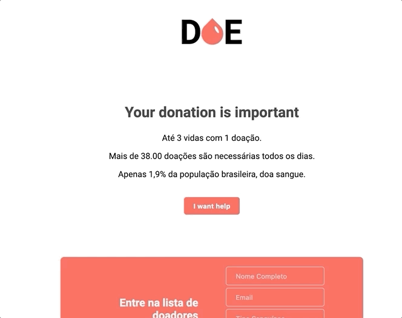

# Marathon Dev

The Doe Sangue system is a blood donor registry, made with Node.js, PostgreSQL and some JS dependencies. Project completed in one week. 

Projected prepared by the [Rocketseat](https://rocketseat.com.br/) team.

## 🖥 Techs
Node.js | Javascript | HTML | CSS | Nodemon | PostgreSQL | Nunjucks

## Donation Lifes



## Instructions

First, if you don't have Node.js you'll need to install it:
* You can do a manual install from here: `https://nodejs.org/en/`. This will include Node and its package manager, `npm`.

* If you are on a Mac and using Homebrew you can do the following:
  + `brew install node --without-npm` (`npm` and Homebrew don't play well together)
  + `curl -L https://www.npmjs.com/install.sh | sh` (so, install `npm` separately)

## Postgres

I used [Postbird]() to configure my database is more simple.

In the file `server.js` change the database configuration.
```
const db = new Pool({
    user: 'postgres',
    password: '',
    host: 'localhost',
    port: 5432,
    database: 'donation'
});
```

And insert the columns:

```
const query = `
        INSERT INTO donors ("name", "email", "blood") 
        VALUES ($1, $2, $3)`;
```

## Once you've got Node installed:
* `git clone git@https://github.com/Igorth/marathondev`
* `cd marathondev`
* `npm install` to install dependencies
* `npm start` to start the project
* `localhost:3000` to see the project running

## Authors

* [**Igor Dias**](https://www.linkedin.com/in/igordiasth/)


## License

This project is licensed under the MIT License - see the [LICENSE.md](LICENSE.md) file for details